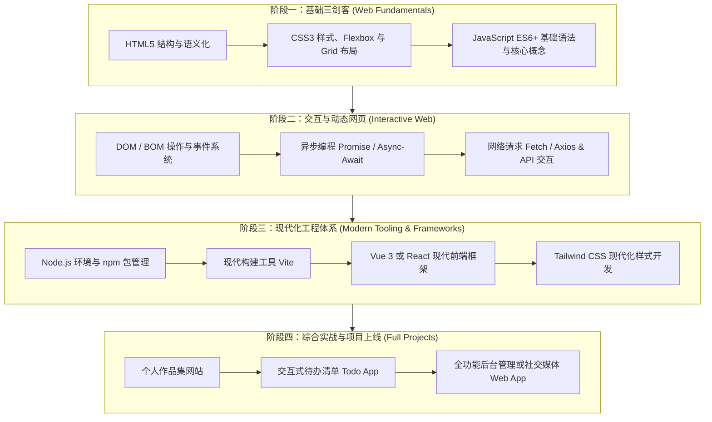

# 🌐 前端从零进阶学习指南 (Front-end Learning Hub)

欢迎来到前端开发的学习工作区！本项目专门用于从零开始系统性学习前端开发技术栈。通过循序渐进的理论讲解与动手实战，带你一步步掌握现代 Web 开发的核心能力。

---

## 🗺️ 学习路线图 (Roadmap)

前端开发的核心体系可分为以下四个进阶阶段：



---

## 📂 推荐目录规划

随着学习的深入，我们将按照主题组织代码练习：

```text
frontdesign/
├── README.md               # 本项目学习指南与进度追踪
├── 01-html-basics/         # 阶段一：HTML 标签、骨架、表单与语义化
├── 02-css-basics/          # 阶段一：CSS 选择器、盒模型、Flex/Grid 布局与动画
├── 03-javascript-basics/   # 阶段一：JS 变量、函数、循环、对象与 ES6+ 特性
├── 04-dom-interaction/     # 阶段二：网页交互、事件监听、动态渲染
├── 05-async-and-api/       # 阶段二：Fetch 请求数据、与后端 API 联动
├── 06-mini-projects/       # 阶段综合小实战（计算器、时钟、天气预报等）
└── 07-vue-or-react/        # 阶段三：组件化开发与单页面应用
```

---

## 🛠️ 推荐开发环境与工具

1. **编辑器**：VS Code 或 Antigravity
   - **推荐插件**：
     - `Live Server`：支持写完代码保存后浏览器自动实时刷新，体验极佳。
     - `Prettier - Code formatter`：代码自动格式化，保持代码整洁美观。
     - `Auto Rename Tag`：修改 HTML 开始标签时自动同步修改闭合标签。
2. **浏览器**：Google Chrome 或 Microsoft Edge
   - 按 `F12` 或 `右键 -> 检查` 可以打开 **开发者工具 (DevTools)**，前端调试的必备神器（Elements 查看元素、Console 输出调试信息、Network 查看网络请求）。

---

## 🚀 快速开始：如何运行与查看网页

1. **直接打开法**：
   - 在文件管理器中找到 `1.html`，直接双击，或者右键选择你的浏览器打开即可。
2. **本地服务法（推荐）**：
   - 若使用 VS Code，在 HTML 文件中右键点击 **“Open with Live Server”**，即可在 `http://127.0.0.1:5500` 实时预览。

---

## 📝 学习进度追踪表

| 序号 | 学习模块                       | 核心知识点                                       |   状态    |
| :--- | :----------------------------- | :----------------------------------------------- | :-------: |
| 01 | **HTML5 骨架与核心标签** | 骨架标签、标题、段落、图片、列表、超链接、基础按钮与点击事件 | ✅ 已完成 (Day 1) |
| 02 | **CSS3 核心基础** | 选择器、文字样式、盒模型 (Margin/Padding/Border)、Flexbox 布局 | ⏳ 进行中 |
| 03   | **现代 CSS 布局**              | Flexbox 弹性布局、Grid 网格布局、响应式设计      | ⬜ 待开始 |
| 04   | **JavaScript 语法入门**        | 变量、数据类型、运算符、分支判断、函数与循环     | ⬜ 待开始 |
| 05   | **DOM 操作与事件**             | 查找元素、修改内容/样式、鼠标与键盘事件监听      | ⬜ 待开始 |
| 06   | **综合小项目**                 | 网页版待办清单 (Todo List)、简易计算器           | ⬜ 待开始 |
| 07   | **异步与网络请求**             | Promise、Async/Await、Fetch API 获取第三方数据   | ⬜ 待开始 |
| 08   | **现代化框架 (Vue 3 / React)** | 组件化、状态驱动视图、路由与工程化构建           | ⬜ 待开始 |
